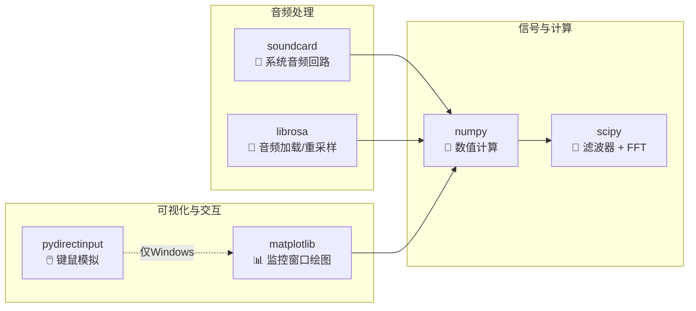
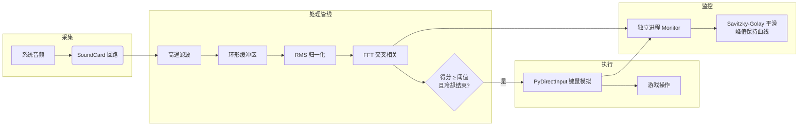

<p align="center">
  
  
  
</p>

# 🎧 NTESoundTrigger

> **基于音频匹配的游戏自动闪避 / 自动反击工具**
> 实时监听系统音频输出，通过 FFT 交叉相关匹配预设波形，检测到攻击音效后自动模拟键鼠操作，瞬间完成闪避或反击。

---

## ✨ 功能亮点

⚡ **快速响应**
优化音频处理管线，检测 + 操作延迟可控，手感紧跟游戏节奏

🎯 **智能匹配**
高通滤波 + FFT 交叉相关，精准识别预设的闪避 / 反击音频波形

🛡️ **自动闪避**
命中闪避音效时，自动点击鼠标右键执行闪避

⚔️ **自动反击**
命中反击音效时，自动点击鼠标左键打出反击

📊 **实时监控**
独立进程运行，展示匹配得分的波形图，搭载 Savitzky‑Golay 平滑与峰值保持算法，曲线圆润不塌陷

⏱️ **独立冷却**
闪避 0.5 s / 反击 1.2 s 独立冷却，杜绝单次音效重复触发

🔄 **设备重连**
音频设备意外断开自动重连，不影响程序持续运行

---

## 🚀 快速开始

### 安装

```bash
git clone https://github.com/Wattls/NTESoundTrigger.git 
cd NTESoundTrigger
pip install -r requirements.txt
```

### 使用

项目已包含预设的闪避/反击音频缓存，无需额外配置，直接运行：

```bash
python Main.py
```

### 自定义音频

1. 将游戏内的闪避/反击音效录制成 `.wav` 文件，放入项目根目录
2. 修改 `Config.py` 中的 `DODGE_WAV` 与 `COUNTER_WAV` 路径
3. 首次运行将自动从 `.wav` 生成 `.npy` 缓存文件，后续启动直接加载，速度更快
4. 程序会自动打开监控窗口，实时展示匹配得分波形
5. 按 `Ctrl+C` 或关闭监控窗口即可退出

---

## 📦 核心依赖



---

## ⚙️ 配置说明

核心参数集中在 `Config.py` 的 `Config` 类中，运行前按需调整：

| 配置项 | 默认值 | 说明 |
|------|------|------|
| `SR` | 32000 | 音频采样率 |
| `CHANNELS` | 2 | 音频通道数 |
| `FRAME` | 0.08 | 每次处理的音频长度（秒），越小延迟越低 |
| `HP_ORDER` | 4 | 高通滤波器阶数 |
| `HP_CUT` | 1000 | 高通滤波器截止频率（Hz） |
| `DODGE_WAV` | `./闪避波形.wav` | 闪避音频样本（本地录制用） |
| `DODGE_THRESH` | 0.13 | 闪避匹配阈值 |
| `COUNTER_WAV` | `./承轨反击波形.wav` | 反击音频样本（本地录制用） |
| `COUNTER_THRESH` | 0.10 | 反击匹配阈值 |
| `ALLOW_REPEAT` | False | 是否允许连续触发 |
| `MONITOR_SEC` | 5 | 监控窗口显示的历史时长（秒） |

---

## 🧠 工作原理



### 技术细节

🌊 **高通滤波**
滤除低频背景噪声，提取攻击音效的高频特征

🔁 **环形缓冲区**
O(1) 写入，多数情况零拷贝读取

🛜 **FFT 交叉相关**
频域卷积，比时域相关快一个数量级

🔊 **RMS 归一化**
消除音量波动对匹配的影响

⏳ **独立冷却**
基于音效时长优化，闪避 0.5 s / 反击 1.2 s

📈 **波形平滑**
Savitzky‑Golay 滤波 + 指数衰减峰值保持，视觉更圆润饱满

---

## 📁 项目结构

```
NTESoundTrigger/
├── 📄 Main.py          # 入口，组装各模块并启动主循环
├── ⚙️ Config.py         # 配置类 / 滤波器 / 音频引擎 / 样本加载
├── 🔍 Listener.py      # 匹配器，环形缓冲区 + FFT 匹配 + 触发逻辑
├── 📊 Monitor.py       # 监控窗口，matplotlib 波形图 + 日志面板
├── 🎮 Trigger.py       # 键盘鼠标模拟（PyDirectInput）
├── 📝 Logger.py        # 日志配置
└── 📋 requirements.txt
```

---

## ⚠️ 注意事项

> 💻 **仅支持 Windows**
> 键鼠模拟基于 PyDirectInput
>
> 🔊 **需要音频回路设备**
> 需要启用系统立体声混音或使用 SoundCard 支持的回路设备
>
> 🛡️ **管理员权限**
> 管理员权限非必需，但部分游戏可能需要以管理员身份运行才能正常发送键鼠输入

---

## 📜 许可证

> 本项目基于 [GPLv3](LICENSE) 许可证开源。

---

## 🙏 致谢

> 本项目基于 [ImLaoBJie/ZZZSoundTrigger](https://github.com/ImLaoBJie/ZZZSoundTrigger) 二次开发，在原始音频触发架构的基础上，进一步优化了音频匹配算法与实时监控模块。
>
> 感谢原作者的辛勤付出与开源精神！

---

## 🕊️ 免责声明

> 使用本项目所产生的一切问题与项目本身及开发者无关。
>
> 若您遇到商家利用本软件进行代练、演示、贩卖或收费，由此产生的任何问题及后果与本项目无关。

---

<p align="center">
  <sub>✨ Made with passion by Wattls ✨</sub>
</p>

